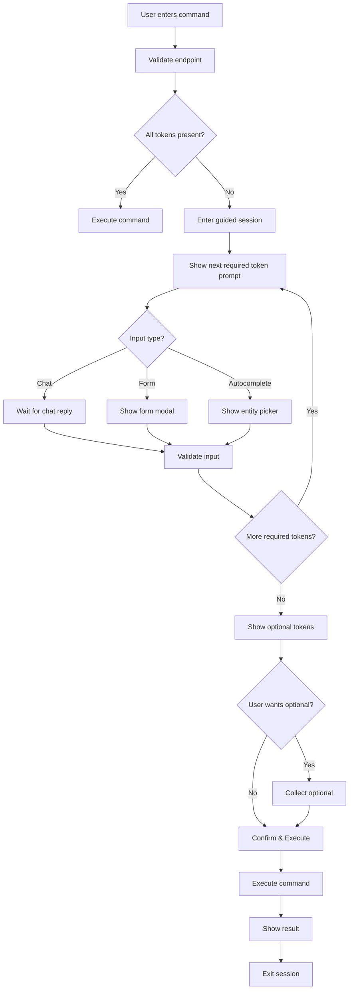

# Guided Session & Token Validation System Design

## Executive Summary

A conversational, AI-assisted interface that guides users through complex transactions by intelligently detecting missing required tokens, providing contextual prompts, and maintaining session state until all necessary information is collected.

## Core Concepts

### 1. Token Validation System

**Purpose**: Analyze incomplete commands to identify what information is needed before execution.

**Components**:
- **Action Tokens**: The verb/action being performed (create, update, delete, list)
- **Entity Tokens**: The type of entity (invoice, payment, client)
- **Property Tokens**: Required fields (amount, client_name, tin, date)
- **Optional Tokens**: Nice-to-have fields (notes, reference_number, tags)

### 2. Validation Endpoint

```typescript
POST /api/validate
{
  "command": "create invoice for Juan Cruz",
  "session_id": "optional-session-uuid"
}

Response:
{
  "valid": false,
  "action": "create",
  "entity": "invoice",
  "plugin": "invoice",
  "missing_required": [
    {
      "token": "amount",
      "type": "number",
      "prompt": "What is the invoice amount?",
      "input_type": "chat",
      "validation": "positive_number"
    },
    {
      "token": "items",
      "type": "array",
      "prompt": "What items/services are you invoicing for?",
      "input_type": "form",
      "fields": [
        {"name": "description", "type": "text", "required": true},
        {"name": "quantity", "type": "number", "required": true},
        {"name": "unit_price", "type": "number", "required": true}
      ]
    }
  ],
  "missing_optional": [
    {
      "token": "due_date",
      "type": "date",
      "prompt": "When is payment due? (default: 30 days)",
      "input_type": "chat",
      "default": "2024-02-15"
    }
  ],
  "provided": {
    "client": {
      "value": "Juan Cruz",
      "resolved_id": "c1",
      "resolved_entity": {
        "name": "Juan Cruz",
        "tin": "123-456-789",
        "email": "juan@example.com"
      }
    }
  },
  "defaults_applied": {
    "company": {
      "name": "My Business Inc.",
      "tin": "987-654-321",
      "vat_registered": true
    }
  },
  "session": {
    "id": "sess_abc123",
    "status": "incomplete",
    "progress": 2,
    "total_required": 4,
    "next_prompt": "amount"
  }
}
```

### 3. Session Management

**Session States**:
- `new` - Just started, analyzing command
- `collecting` - Gathering required tokens
- `confirming` - All required collected, showing optional
- `ready` - Ready to execute
- `completed` - Transaction executed
- `cancelled` - User exited session

**Session Storage**:
```json
{
  "id": "sess_abc123",
  "command": "create invoice for Juan Cruz",
  "plugin": "invoice",
  "action": "create",
  "collected_tokens": {
    "client": "Juan Cruz",
    "amount": null,
    "items": null
  },
  "remaining_required": ["amount", "items"],
  "remaining_optional": ["due_date", "notes"],
  "conversation_history": [
    {"role": "user", "content": "create invoice for Juan Cruz"},
    {"role": "assistant", "content": "Creating invoice for Juan Cruz. What is the invoice amount?"},
    {"role": "user", "content": "25000"},
    {"role": "assistant", "content": "Amount set to ₱25,000. What items/services are you invoicing for?"}
  ],
  "created_at": "2024-01-15T10:00:00Z",
  "updated_at": "2024-01-15T10:01:00Z"
}
```

### 4. Token Schema Definition

```yaml
# plugins/invoice/tokens.yaml
plugin: invoice
actions:
  create:
    required:
      - token: client
        type: entity_reference
        entity_type: client
        prompt: "For which client?"
        input_type: autocomplete
        
      - token: amount
        type: number
        prompt: "What is the total amount?"
        input_type: chat
        validation:
          min: 0
          max: 999999999
          
      - token: items
        type: array
        min_items: 1
        prompt: "What items/services are you invoicing for?"
        input_type: form
        schema:
          description: string
          quantity: number
          unit_price: number
          
    optional:
      - token: due_date
        type: date
        prompt: "When is payment due?"
        input_type: chat
        default: "+30days"
        
      - token: notes
        type: text
        prompt: "Any additional notes?"
        input_type: chat
        
      - token: tax_exempt
        type: boolean
        prompt: "Is this tax exempt?"
        input_type: chat
```

### 5. UI/UX Design

**Session Bubble Interface**:
```
┌─────────────────────────────────────────────────┐
│ 🔄 Creating Invoice (Step 2 of 4)               │
│ ─────────────────────────────────────────       │
│                                                  │
│ ✅ Client: Juan Cruz                            │
│ 📝 Amount: [Waiting for input...]                │
│ ⏳ Items: Pending                               │
│ ⏳ VAT: Auto-calculate                          │
│                                                  │
│ "What is the invoice amount?"                   │
│                                                  │
│ [25000                                    ] 📤  │
│                                                  │
│ [Exit Session] [Skip Optional] [Reset]          │
└─────────────────────────────────────────────────┘
```

**Smart Form Detection**:
- Simple values (amount, date) → Chat input
- Complex objects (items, addresses) → Form modal
- Entity references → Autocomplete dropdown
- Boolean → Quick yes/no buttons

### 6. Default Values System

**User Profile Defaults**:
```json
{
  "user_id": "user_123",
  "defaults": {
    "company": {
      "name": "ABC Trading Co.",
      "tin": "123-456-789-000",
      "vat_registered": true,
      "address": "123 Ayala Ave, Makati"
    },
    "invoice": {
      "due_days": 30,
      "default_terms": "Net 30",
      "currency": "PHP"
    },
    "tax": {
      "vat_rate": 0.12,
      "ewt_rate": 0.02
    }
  }
}
```

### 7. Implementation Flow



### 8. Advanced Features

**Contextual Intelligence**:
- Learn from previous transactions
- Suggest likely values based on history
- Auto-complete recurring patterns
- Smart defaults based on client/vendor

**Multi-step Transactions**:
```
User: "create invoice and record payment"
System: Enters multi-step session
  Step 1: Complete invoice creation
  Step 2: Complete payment recording
  Step 3: Link payment to invoice
```

**Error Recovery**:
- Validate as user types
- Show inline errors
- Suggest corrections
- Allow easy editing of collected tokens

### 9. API Endpoints

```typescript
// Validate command and get missing tokens
POST /api/validate
Body: { command: string, session_id?: string }

// Submit token value for session
POST /api/session/{session_id}/token
Body: { token: string, value: any }

// Get session status
GET /api/session/{session_id}

// Cancel session
DELETE /api/session/{session_id}

// Execute completed session
POST /api/session/{session_id}/execute

// Get user defaults
GET /api/user/defaults

// Update user defaults
PUT /api/user/defaults
Body: { defaults: object }
```

### 10. Benefits

1. **Lower Learning Curve**: Users don't need to know all syntax
2. **Fewer Errors**: Validation before execution
3. **Faster Data Entry**: Smart defaults and autocomplete
4. **Better UX**: Conversational, guided experience
5. **Flexibility**: Exit and resume sessions
6. **Compliance**: Ensures all required fields are filled

### 11. Example Interaction

```
User: create invoice for Juan
Assistant: I'll help you create an invoice for Juan Cruz.

📋 Creating Invoice (Client: Juan Cruz)
Required information needed:
- Amount ← Current step
- Items/Services
- VAT calculation

What is the invoice amount?

User: 50000
Assistant: Amount set to ₱50,000. 

What items or services are you invoicing for?
[Show form with fields: Description, Quantity, Unit Price]

User: [Fills form: "Consulting Services", 1, 50000]
Assistant: Perfect! I have all required information.

Optional: Would you like to set a specific due date? 
(Default: 30 days from today - Feb 15, 2024)

User: no
Assistant: Invoice created successfully!
- Invoice #: INV-2024-0001
- Client: Juan Cruz
- Amount: ₱50,000
- VAT: ₱6,000
- Total: ₱56,000
- Due: Feb 15, 2024

Would you like to email this to the client?
```

### 12. Technical Implementation Priority

**Phase 1: Core Validation**
- Token schema definitions
- Validation endpoint
- Missing token detection

**Phase 2: Session Management**
- Session state storage
- Token collection flow
- Progress tracking

**Phase 3: UI Components**
- Session bubble interface
- Form vs chat detection
- Progress indicators

**Phase 4: Smart Features**
- Default values system
- Entity autocomplete
- Historical suggestions

**Phase 5: Advanced**
- Multi-step transactions
- Offline support
- WASM SQLite frontend

This design creates an intuitive, error-resistant system that guides users through complex bookkeeping tasks while maintaining flexibility and efficiency.