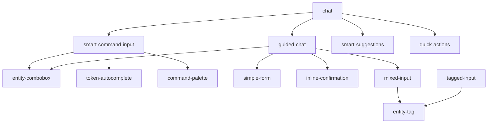

# TaxTalk Component Extraction Plan

## Executive Summary

This plan outlines the extraction of 27 UI components from the monolithic web app into isolated, testable crates. Each component will be developed as a standalone plugin that can be tested in isolation and integrated back into the main application.

## Component Inventory & Categorization

### 🔤 Token Resolution Components (Priority 1)
These components handle token parsing, entity resolution, and command input.

#### 1. **EntityCombobox** (`entity-combobox`)
- **Purpose**: Dropdown selector for entities (clients, suppliers, products)
- **Dependencies**: API calls, Entity type
- **Used for**: `@client`, `@supplier`, `@product` token resolution
- **Complexity**: Medium
- **Status**: Ready for extraction

#### 2. **TokenAutocomplete** (`token-autocomplete`)
- **Purpose**: Shows token hints and suggestions while typing
- **Dependencies**: TokenHint type, textarea reference
- **Used for**: Autocomplete suggestions for `@` tokens
- **Complexity**: Low
- **Status**: Ready for extraction

#### 3. **SmartCommandInput** (`smart-command-input`)
- **Purpose**: Main chat input with command/AI mode switching
- **Dependencies**: Multiple sub-components, API validation
- **Used for**: Primary chat interface input
- **Complexity**: Very High
- **Status**: Needs decomposition

#### 4. **EntityTag** (`entity-tag`)
- **Purpose**: Visual representation of resolved entities as tags
- **Dependencies**: EntityToken type
- **Used for**: Displaying selected entities
- **Complexity**: Low
- **Status**: Ready for extraction

#### 5. **TaggedInput** (`tagged-input`)
- **Purpose**: Input field that supports entity tags
- **Dependencies**: EntityTag component
- **Used for**: Mixed text and entity input
- **Complexity**: Medium
- **Status**: Ready for extraction

### 📝 Form & Input Components (Priority 2)

#### 6. **SimpleForm** (`simple-form`)
- **Purpose**: Basic form builder for structured data entry
- **Dependencies**: FormField types
- **Used for**: Quick structured input
- **Complexity**: Medium
- **Status**: Ready for extraction

#### 7. **MixedInput** (`mixed-input`)
- **Purpose**: Handles mixed text and entity tokens
- **Dependencies**: Entity types, token parser
- **Used for**: Complex mixed input scenarios
- **Complexity**: High
- **Status**: Needs refactoring

#### 8. **DualModeInput** (`dual-mode-input`)
- **Purpose**: Switch between command and form modes
- **Dependencies**: Multiple input components
- **Used for**: Flexible input switching
- **Complexity**: High
- **Status**: Currently disabled, needs fixing

#### 9. **CommandEntityInput** (`command-entity-input`)
- **Purpose**: Command input with entity resolution
- **Dependencies**: EntityCombobox, command parser
- **Used for**: Structured command input
- **Complexity**: Medium
- **Status**: Ready for extraction

#### 10. **MultiSelectCombobox** (`multi-select-combobox`)
- **Purpose**: Select multiple entities from dropdown
- **Dependencies**: Entity API, checkbox list
- **Used for**: Multiple entity selection
- **Complexity**: Medium
- **Status**: Ready for extraction

### 🎯 Smart UI Components (Priority 3)

#### 11. **SmartSuggestions** (`smart-suggestions`)
- **Purpose**: Context-aware suggestions based on input
- **Dependencies**: Suggestion engine
- **Used for**: Intelligent hints
- **Complexity**: Medium
- **Status**: Ready for extraction

#### 12. **QuickActions** (`quick-actions`)
- **Purpose**: Quick action buttons based on context
- **Dependencies**: Action definitions
- **Used for**: Common action shortcuts
- **Complexity**: Low
- **Status**: Ready for extraction

#### 13. **CommandPalette** (`command-palette`)
- **Purpose**: Searchable command interface (like VS Code)
- **Dependencies**: Command registry, keyboard handler
- **Used for**: Power user features
- **Complexity**: Medium
- **Status**: Ready for extraction

#### 14. **InlineConfirmation** (`inline-confirmation`)
- **Purpose**: Shows parsed data for confirmation
- **Dependencies**: ParsedField types
- **Used for**: Data validation UI
- **Complexity**: Low
- **Status**: Ready for extraction

### 💬 Chat Components (Priority 4)

#### 15. **Chat** (`chat`)
- **Purpose**: Main chat interface
- **Dependencies**: All input components, message renderer
- **Used for**: Primary chat UI
- **Complexity**: Very High
- **Status**: Needs major refactoring

#### 16. **GuidedChat** (`guided-chat`)
- **Purpose**: Wizard-style guided chat interface
- **Dependencies**: Multiple components, validation
- **Used for**: Structured conversations
- **Complexity**: Very High
- **Status**: Needs decomposition

### 🔧 Utility Components (Already Extracted)

#### 17. **FileUpload** ✅
- **Status**: COMPLETED
- **Location**: `components/file-upload`

#### 18. **DynamicTable** ✅
- **Status**: COMPLETED
- **Location**: `components/dynamic-table`

#### 19. **ConditionalForm** ⚠️
- **Status**: Partially complete (compilation issues)
- **Location**: `components/conditional-form`

#### 20. **ReceiptScanner** 
- **Status**: Planned
- **Complexity**: High (needs OCR mock)

### 🧩 Supporting Components

#### 21. **AutocompleteSimple** (`autocomplete-simple`)
- **Purpose**: Basic autocomplete functionality
- **Dependencies**: Search API
- **Complexity**: Low

#### 22. **CounterBtn** (`counter-btn`)
- **Purpose**: Simple counter button
- **Dependencies**: None
- **Complexity**: Trivial

#### 23. **Plugins** (`plugins`)
- **Purpose**: Plugin management UI
- **Dependencies**: Plugin registry
- **Complexity**: Medium

## Extraction Strategy

### Phase 1: Core Token Components (Week 1)
Extract the fundamental token resolution components:

```
1. entity-tag (Day 1)
2. token-autocomplete (Day 1)
3. entity-combobox (Day 2)
4. quick-actions (Day 2)
5. smart-suggestions (Day 3)
6. inline-confirmation (Day 3)
7. command-palette (Day 4-5)
```

### Phase 2: Input Components (Week 2)
Extract form and input handling:

```
8. simple-form (Day 1)
9. multi-select-combobox (Day 2)
10. tagged-input (Day 3)
11. command-entity-input (Day 4-5)
```

### Phase 3: Complex Components (Week 3-4)
Refactor and extract the complex components:

```
12. mixed-input (refactor first)
13. smart-command-input (decompose into smaller parts)
14. chat (major refactoring needed)
15. guided-chat (decompose)
```

## Component Template Structure

Each component crate should follow this structure:

```
components/
├── {component-name}/
│   ├── Cargo.toml
│   ├── README.md
│   ├── index.html
│   ├── Trunk.toml
│   ├── src/
│   │   ├── lib.rs       # Component export
│   │   ├── main.rs      # Demo/test app
│   │   ├── component.rs # Main component
│   │   ├── types.rs     # Component-specific types
│   │   └── styles.css   # Component styles
│   └── examples/
│       └── basic.rs     # Usage example
```

## Dependency Graph



## Component Interfaces

### Standard Component Props Pattern

```rust
#[component]
pub fn ComponentName(
    // Data props
    value: Signal<T>,
    
    // Callbacks
    on_change: Callback<T, ()>,
    on_submit: Option<Callback<T, ()>>,
    
    // Configuration
    #[prop(default = true)] enabled: bool,
    #[prop(optional)] config: Option<Config>,
    
    // Styling
    #[prop(optional)] class: Option<String>,
) -> impl IntoView
```

### Shared Types (in `core` crate)

```rust
// Entity types
pub struct Entity {
    pub id: String,
    pub entity_type: String,
    pub display_name: String,
    pub metadata: Option<serde_json::Value>,
}

// Token types
pub struct Token {
    pub token_type: String,
    pub value: String,
    pub position: usize,
    pub resolved: Option<Entity>,
}

// Component types
pub enum ComponentType {
    EntitySelector,
    TextInput,
    NumberInput,
    AmountInput,
    DatePicker,
    Select(Vec<String>),
    Boolean,
    FileUpload,
}
```

## Testing Strategy

Each component should have:

1. **Standalone Demo** (`src/main.rs`)
   - Interactive demo with all features
   - Multiple usage scenarios
   - State inspection

2. **Unit Tests** (`src/lib.rs`)
   - Component rendering
   - Event handling
   - State management

3. **Integration Examples** (`examples/`)
   - How to use with other components
   - Common patterns
   - Edge cases

## Migration Plan

### Step 1: Create Component
```bash
cd components
cargo new --lib {component-name}
```

### Step 2: Copy Code
- Extract component from `web/src/components/{component}.rs`
- Identify dependencies
- Create types.rs for component-specific types

### Step 3: Create Demo
- Build interactive demo in main.rs
- Add CSS with component prefix
- Test all functionality

### Step 4: Document
- Create README with usage examples
- Document all props
- Show common patterns

### Step 5: Integrate Back
- Update main app to use external crate
- Remove old component file
- Test integration

## Success Metrics

- ✅ Each component runs standalone with `trunk serve`
- ✅ No circular dependencies
- ✅ Clear, documented APIs
- ✅ Reusable across projects
- ✅ Testable in isolation
- ✅ Performance maintained or improved

## Priority Components for Token Resolution

Based on your specific question about token resolution, here are the key components:

### Primary Token Components:
1. **EntityCombobox** - Resolves `@client`, `@supplier`, etc.
2. **TokenAutocomplete** - Provides token suggestions
3. **EntityTag** - Displays resolved tokens
4. **TaggedInput** - Handles mixed text/token input

### Supporting Components:
5. **SmartSuggestions** - Context-aware hints
6. **InlineConfirmation** - Shows parsed token data
7. **CommandPalette** - Advanced command input
8. **QuickActions** - Token-specific actions

### Complex Integration:
9. **SmartCommandInput** - Main integration point
10. **GuidedChat** - Full conversation flow

## Next Steps

1. Start with `entity-tag` as the simplest component
2. Move to `token-autocomplete` and `entity-combobox`
3. Build up to `smart-command-input` after dependencies are ready
4. Refactor complex components last

This plan provides a clear path to extract all components into testable, maintainable crates that can be developed and tested in isolation.