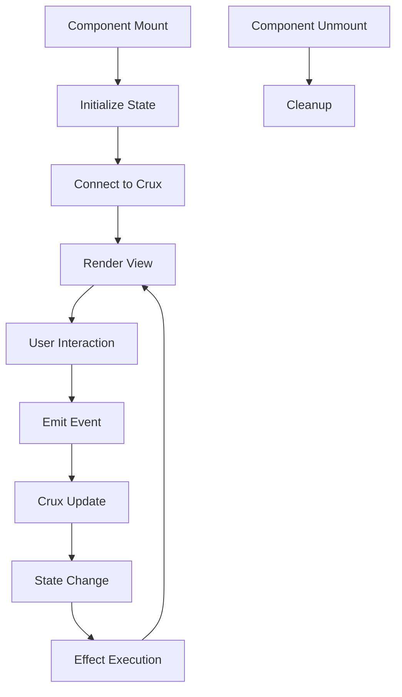

# Crux Integration Patterns for TaxTalk UI Components

## Overview

This document outlines the standard patterns for integrating TaxTalk UI components with the Crux state management system. All extracted components follow these patterns to ensure consistency and maintainability.

## Core Principles

1. **Unidirectional Data Flow**: State changes flow through Crux's update/effect/view cycle
2. **Event-Driven Updates**: Components emit events that Crux processes into state changes
3. **Effect Isolation**: Side effects are handled separately from pure state updates
4. **Type Safety**: All state, actions, and effects are strongly typed

## Architecture Pattern

```rust
// Component State
#[derive(Clone, Debug, Serialize, Deserialize)]
pub struct ComponentState {
    // Component-specific state fields
}

// Actions (Commands)
#[derive(Clone, Debug, Serialize, Deserialize)]
pub enum ComponentAction {
    // User-initiated actions
}

// Effects (Side Effects)
#[derive(Clone, Debug, Serialize, Deserialize)]
pub enum ComponentEffect {
    // External interactions
}
```

## Implementation Examples

### 1. EntityTag Component

**State Management:**
```rust
pub struct EntityTagState {
    pub token: Option<EntityToken>,
    pub is_removing: bool,
}
```

**Integration Pattern:**
```rust
// In component
Effect::new(move |_| {
    if let Some(token) = token.get() {
        set_state.update(|s| {
            s.token = Some(token);
            s.is_removing = false;
        });
    }
});

// Callback to parent via Crux
on_remove.run(token_id.clone());
```

### 2. TokenAutocomplete Component

**State Management:**
```rust
pub struct TokenAutocompleteState {
    pub is_showing: bool,
    pub query: String,
    pub selected_index: usize,
    pub cursor_position: usize,
    pub recent_tokens: Vec<TokenHint>,
}
```

**Event Processing:**
```rust
pub enum TokenAutocompleteAction {
    ShowHints,
    HideHints,
    UpdateQuery(String),
    SelectToken(TokenHint),
    NavigateUp,
    NavigateDown,
}
```

**Effect Handling:**
```rust
pub enum TokenAutocompleteEffect {
    FocusInput,
    UpdateInputValue(String),
    ScrollToSelected,
    TriggerCallback(TokenHint),
}
```

## Integration with Main App

### Step 1: Define Component in Crux App State

```rust
// In core/src/lib.rs
pub struct App {
    // Other state...
    pub entity_tags: Vec<EntityToken>,
    pub autocomplete_state: TokenAutocompleteState,
}
```

### Step 2: Handle Component Events

```rust
impl App {
    pub fn update(&mut self, event: Event, capabilities: &Capabilities) {
        match event {
            Event::TokenSelected(hint) => {
                // Process token selection
                self.autocomplete_state.add_recent(hint);
                // Trigger any necessary effects
                capabilities.render.render();
            }
            Event::EntityRemoved(id) => {
                self.entity_tags.retain(|t| t.id != id);
                capabilities.render.render();
            }
            // Other events...
        }
    }
}
```

### Step 3: Connect Component to Crux

```rust
// In view layer
let crux_callback = Callback::new(move |action| {
    // Send action to Crux
    let event = Event::ComponentAction(action);
    crux_app.update(event, &capabilities);
});

view! {
    <TokenAutocomplete
        on_token_select=crux_callback
        // Other props...
    />
}
```

## State Synchronization Patterns

### Pattern 1: Reactive State Binding

```rust
// Derive signals from Crux state
let token_signal = Signal::derive(move || {
    crux_state.get().entity_tags.get(index).cloned()
});

// Pass to component
<EntityTag token=token_signal />
```

### Pattern 2: Event Aggregation

```rust
// Batch multiple component events
let batch_handler = move |events: Vec<ComponentAction>| {
    for action in events {
        crux_app.update(Event::from(action), &capabilities);
    }
};
```

### Pattern 3: Optimistic Updates

```rust
// Update local state immediately
set_local_state.update(|s| s.is_loading = true);

// Send to Crux for persistence
crux_callback.run(ComponentAction::Save(data));
```

## Performance Optimizations

### 1. Memoization

```rust
let filtered_hints = Memo::new(move |_| {
    let state = state.get();
    expensive_filter_operation(&state.hints, &state.query)
});
```

### 2. Debouncing

```rust
use gloo_timers::future::TimeoutFuture;

let debounced_search = move |query: String| {
    spawn_local(async move {
        TimeoutFuture::new(300).await;
        crux_callback.run(ComponentAction::Search(query));
    });
};
```

### 3. Virtual Scrolling

```rust
// Only render visible items
let visible_range = calculate_visible_range(scroll_position, item_height);
let visible_items = items[visible_range.start..visible_range.end];
```

## Testing Patterns

### Unit Testing Component State

```rust
#[test]
fn test_state_transitions() {
    let mut state = TokenAutocompleteState::new();
    
    state.add_recent(TokenHint {
        token: "@client".to_string(),
        // ...
    });
    
    assert_eq!(state.recent_tokens.len(), 1);
}
```

### Integration Testing with Crux

```rust
#[test]
fn test_crux_integration() {
    let mut app = App::default();
    let capabilities = test_capabilities();
    
    app.update(Event::TokenSelected(hint), &capabilities);
    
    assert!(app.autocomplete_state.recent_tokens.contains(&hint));
}
```

## Migration Guide

### Converting Existing Components

1. **Extract State**: Move component state to dedicated struct
2. **Define Actions**: Create enum for all user interactions
3. **Identify Effects**: List all side effects (API calls, DOM updates)
4. **Wire Callbacks**: Replace direct mutations with Crux events
5. **Test Integration**: Verify state synchronization

### Example Migration

**Before (Direct State):**
```rust
let (value, set_value) = signal(String::new());
set_value.set("new value".to_string());
```

**After (Crux Integration):**
```rust
let update_value = move |value: String| {
    crux_callback.run(ComponentAction::UpdateValue(value));
};
```

## Best Practices

1. **Keep Components Pure**: Components should only render based on props
2. **Centralize State**: All business logic lives in Crux
3. **Type Everything**: Use strong types for all state and events
4. **Document Events**: Clearly document what each event does
5. **Test Thoroughly**: Unit test state logic, integration test with Crux

## Common Pitfalls

1. **Avoid Direct State Mutation**: Always go through Crux
2. **Don't Mix Concerns**: Keep UI logic separate from business logic
3. **Watch for Infinite Loops**: Be careful with Effects that trigger updates
4. **Memory Leaks**: Clean up event listeners and subscriptions

## Component Lifecycle



## Resources

- [Crux Documentation](https://crux.rediculous.io)
- [Leptos Reactive System](https://leptos.dev)
- [Component Examples](./examples/)
- [Testing Guide](./TESTING.md)